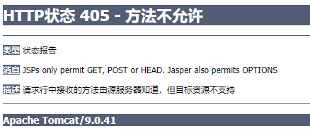

# 1 概述

## 1.1 Spring MVC 概述

1. Spring 是为展现层提供的基于 MVC 设计理念的优秀的 Web 框架，是目前最主流的 MVC 框架之一。
2. Spring3.0 后全面超越 Struts2，成为最优秀的 MVC 框架。
3. SpringMVC 通过一套 MVC 注解，让 POJO（Plain Old Java Object）称为处理请求的控制器，而无实现任何接口。
4. 支持 REST 风格的 URL 请求。
5. 采用了松散耦合可插拔组件结构，比其他 MVC 框架更具拓展性和灵活性。

SpringMVC 是一种轻量级的，基于 MVC 的 Web 层应用框架，Spring框架的一个后续产品。

## 1.2 SPring MVC 能干什么

1. 天生与 Spring 框架集成，如：IOC， AOP
2. 支持 RESTful 风格
3. 进行更简洁的 Web 层开发
4. 支持灵活的 URL 到页面控制器的映射
5. 非常容易与其他试图技术集成，如：Velocity、FreeMarker 等
6. 因为模型数据不存放在特定的 API 里，而是存放在一个 Model 里（Map 数据结构实现，因此很容易被其他框架使用）
7. 非常灵活的数据验证、格式化和数据绑定机制，用使用任何对象进行数据绑定，不必实现特定框架的 API
8. 更加简单、强大的异常处理
9. 对静态资源的支持
10. 支持灵活的本地化、主题解析

## 1.3 Spring MVC 怎么使用

1. 将 Web 层进行了指责解耦，基于请求-响应模型
2. 常用主要组件：
    1. `DispatcherServlet`：前端控制器/中央控制器，把请求给转发到具体的控制类
    2. `Controller`：处理器/页面控制器，具体处理请求的控制器
    3. `HandlerMapping`：映射处理器，负责映射中央处理器转发给 `Controller` 时的映射策略
    4. `ViewResolver`：视图解析器，解析具体的视图
    5. `LocalResolver`：本土化、国际化解析器
    6. `MultipartResolver`：文件上传解析器
    7. `HandlerExceptionResolver`：异常处理器

## 1.4 Spring MVC 搭建

1. 使用 Maven 导入依赖 `spring-webmvc`
2. 在 `web.xml` 中配置 Spring MVC 核心（前端）控制器 `DispatcherServlet`

`<url-pattern>` 元素参考[<url-pattern> 规则](https://github.com/Zerxoi/JavaWeb/blob/master/note/20_Filter%E8%BF%87%E6%BB%A4%E5%99%A8/filter.md#filter-%E6%8B%A6%E6%88%AA%E8%B7%AF%E5%BE%84url-pattern-%E8%A7%84%E5%88%99)

```xml
<web-app>
  <servlet>
    <servlet-name>mvc</servlet-name>
    <servlet-class>org.springframework.web.servlet.DispatcherServlet</servlet-class>
  </servlet>
  <servlet-mapping>
    <servlet-name>mvc</servlet-name>
    <url-pattern>/</url-pattern>
  </servlet-mapping>
</web-app>
```

作用：加载 Spring MVC 的配置文件，DispatcherServlet 会自动加载配置文件。配置文件的默认位置为 `WEB-INF/[servlet-name]-servlet.xml`。

3. 配置文件 `mvc-servlet.xml`

配置 `id` 为 `mvc` 的前端 Servlet，在 `xyz.zerxoi.controller` 包中扫描控制器 `Controller` 和创建并配置视图解析器 `viewResolver`。

视图解析器可以指定多个，通过 `order` 属性来指定优先级。

```xml
<?xml version="1.0" encoding="UTF-8"?>
<beans xmlns="http://www.springframework.org/schema/beans"
    xmlns:xsi="http://www.w3.org/2001/XMLSchema-instance"
    xmlns:context="http://www.springframework.org/schema/context"
    xsi:schemaLocation="http://www.springframework.org/schema/beans
        https://www.springframework.org/schema/beans/spring-beans.xsd
        http://www.springframework.org/schema/context
        https://www.springframework.org/schema/context/spring-context.xsd">
    <!-- 扫描组件，将加上 @Controller 注解的类作为 Spring MVC 的控制层 -->
    <context:component-scan base-package="xyz.zerxoi.web"></context:component-scan>
    <!-- 配置视图解析器，视图解析器会根据 prefix + 视图名称（请求映射方法的返回值） + suffix 确定要跳转的页面 -->
    <bean id="viewResolver" class="org.springframework.web.servlet.view.InternalResourceViewResolver">
        <property name="prefix" value="/WEB-INF/view/"></property>
        <property name="suffix" value=".jsp"></property>
    </bean>
</beans>
```

4. 创建并配置控制器对象

在 `xyz.zerxoi.controller` 包中创建一个 POJO 类，在此类上添加 `@Controller` 注解，Spring MVC 创建该类的实例作为控制器对象，让其处理请求和响应。

在控制器中，通过在方法上添加 `@RequestMapping` 注解将请求路径与方法进行映射；请求映射路径不需要与方法名一致，但最好是一致的。

请求处理方法会返回一个字符串，即**视图名称**，配置文件中创建的视图解析器会根据 `prefix` 属性、视图名称和 `suffix` 属性确定跳转页面。

```java
// 创建并配置控制器对象
@Controller
public class MvcController {
    // 配置请求映射,将 hello 路径与该方法进行映射,映射与方法名无关
    @RequestMapping("hello")
    public String hello() {
        System.out.println("Hello");
        // 视图名称
        return "SUCCESS";
    }

    @RequestMapping("login")
    // 带参数的请求映射
    public String login(String username, String password) {
        System.out.println("Username ================ " + username);
        System.out.println("Password ================ " + password);
        return "SUCCESS";
    }
}
```

5. 测试页面

```html
<html>
<head>
    <title>Index</title>
</head>
<body>
    <a href="hello">
        <button>Hello</button>
    </a><br>
    <hr>
    <form action="login" method="post">
        <label for="username">Username </label><input type="text" name="username" id="username"><br>
        <label for="password">Password </label><input type="text" name="password" id="passowrd"><br>
        <input type="submit" value="Login">
    </form>
</body>
</html>
```

## 1.5 `@RequestMapping`

参考：

[@RequestMapping中的相对路径问题 @FDDLC](https://blog.csdn.net/liuxc324/article/details/108890332)

[RequestMapping](https://docs.spring.io/spring-framework/docs/current/javadoc-api/org/springframework/web/bind/annotation/RequestMapping.html)

- `@RequestMapping` 可以作用目标可以时类型（类，接口或者枚举定义）和方法
    - `name`：当在类型和方法两个级别上使用时，组合名称是通过以 `#` 作为分隔符的串联产生的
    - `path` 和 `value`：当在类型级别使用时，所有方法级别的映射都继承此路径映射，从而将其缩小为特定的处理程序方法
    - `method`：在类型级别使用时，所有方法级别的映射都继承此HTTP方法限制
    - `params`：在类型级别使用时，所有方法级别的映射都继承此参数限制
    - `headers`：在类型级别使用时，所有方法级别的映射都继承此请求头限制
- 方法的请求映射路径 = 类型映射路径 + 方法映射路径，例如类映射路径为 `@RequestMapping("/mvc")`，方法的映射路径为 `@RequestMapping("/hello")`，会将方法映射到 `/mvc/hello` 路径
- 类和方法的映射路径前的 `/` 可省略；类映射路径和方法映射路径拼接时，如果有多余的 `/`，会自动去除；如果缺少 `/`，则会自动补充
- 映射路径可以使用 [Ant 模式风格](https://docs.spring.io/spring-framework/docs/current/javadoc-api/org/springframework/util/AntPathMatcher.html)
    - `?`：匹配一个字符
    - `*`：匹配零个或多个字符
    - `**`：匹配路径中的零个或多个目录
    - `{spring：[a-z]+}`：占位符与正则表达式 `[a-z]+` 匹配，并将匹配结果作为名为 `spring` 的路径变量
    - Ant 模式风格拼接结果参考[AntPathMatcher.combine](https://docs.spring.io/spring-framework/docs/current/javadoc-api/org/springframework/util/AntPathMatcher.html#combine-java.lang.String-java.lang.String-)
- 映射路径占位符示例
```java
@RequestMapping(value = "/hello/{name}", method = RequestMethod.GET)
public String hello(@PathVariable("name") String name) {
    System.out.println("Hello, " + name);
    return "SUCCESS";
}
```
- Ant 模式风格占位符
```java
@RequestMapping(value = "/hello/{name:\\w+}", method = RequestMethod.GET)
public String hello(@PathVariable("name") String name) {
    System.out.println("Hello, " + name);
    return "SUCCESS";
}
```
- 如果方法映射路径末尾带 `/`，请求路径末尾也应该添加 `/`；如果方法映射路径末尾不带 `/`，请求路径末尾可以添加也可以不添加 `/`。这可能是由于 [setUseTrailingSlashMatch](https://docs.spring.io/spring-framework/docs/current/javadoc-api/org/springframework/web/servlet/mvc/method/annotation/RequestMappingHandlerMapping.html#setUseTrailingSlashMatch-boolean-) 所导致的。
- `@RequestMapping` 有多个属性，用于
    - `method`：要映射到的HTTP请求方法，缩小路径映射:`GET`、`POST`、`HEAD`、`OPTIONS`、`PUT`、`PATCH`、`DELETE`、`TRACE`
    - `params`：指定映射请求的参数的表达式，从而缩小了路径映射的范围。
        - `myParam=myValue`：参数 `myParam` 等于给定值 `myValue` 时映射请求
        - `myParam!=myValue`：参数 `myParam` 不等于给定值 `myValue` 时映射请求
        - `myParam`：请求中包含参数 `myParam` （参数可以是任意值）时映射请求
        - `!myParam`：请求中包含不参数 `myParam` 时映射请求
    - `headers`：指定映射请求头的表达式，从而缩小了路径映射的范围。
        - `My-Header=myValue`：请求头 `My-Header` 等于给定值 `myValue` 时映射请求
        - `My-Header!=myValue`：参数 `My-Header` 不等于给定值 `myValue` 时映射请求
        - `My-Header`：请求中包含请求头 `My-Header`（请求头可以时任意值）时映射请求
        - `!My-Header`：请求中不包含请求头 `My-Header` 时映射请求
        - 对于请求头（例如 `Accept` 和 `Content-Type`），还支持媒体类型通配符（`*`），例如 `Content-Type=text/*`

## 1.6 REST

参考：

https://kb.cnblogs.com/page/186516/

https://www.infoq.cn/article/rest-introduction/

**REST(Representational State Transfer)**，即（资源）表现层状态转换，是目前最流行的一种互联网软件架构。

1. **资源（Resources）**：网络上的一个实体，或者说是网络上的一个具体信息。它可以是一段文本、一张图片、一首歌曲、一种服务，总之就是一个具体的存在。可以用一个 URI（统一资源定位符）指向它，每种资源对应一个特定的 URI。获取这个资源，访问对应资源的 URI 就可以了，因此 URI 是为每一个资源独一无二的标识符。
2. **表现层（Representation）**：把资源具体呈现出来的形式，叫做它的表现层。比如，文本可以用 HTML 格式、 XML 格式、JSON 格式表现，甚至可以采用二进制格式。
3. **状态转化（State Transfer）**：没发出一个请求就代表了客户端和服务器的一次交互过程。HTTP 协议是一个无状态协议，即所有状态都保存在服务器（会话），一些相对不重要的数据会保存在客户端（Cookie）。因此，如果客户端想要操作服务器，必须通过魔种手段，让服务器端发生状态转化。这种转化是建立在表现层上的，所以就是表现层转化。
4. 具体说，就是 HTTP 协议里面，四个操作表示操作方式的动词：`GET`，`POST`，`PUT`，`DELETE`。它们分别对应四种基本操作：
    - `GET` 用来获取资源
    - `POST` 用来新建资源
    - `PUT` 用来更新资源
    - `DELETE` 用来删除资源

### 请求方法转换

虽然服务器可以接收并处理多种方法的请求，但是浏览器通常情况下只能发送 `GET` 和 `POST` 请求。

为了让服务器接收到其他方法的请求，可以通过**过滤器**或者**监听器**在请求发送到 Servlet 服务之前对请求的方法进行修改。在 Spring MVC 中已经为我们实现了一个这样的类————`org.springframework.web.filter.HiddenHttpMethodFilter`。

`HiddenHttpMethodFilter` 是 `Filter` 的实现类，请求通过 `Filter` 接口的 `doFilter` 方法进行过滤。`HiddenHttpMethodFilter` 的 `doFilter` 在其父类 `OncePerRequestFilter` 中定义：

该代码大意是如果服务器请求**需要进行过滤**并且**之前未被该过滤器过滤**时，使用 `HiddenHttpMethodFilter` 的 `doFilterInternal` 进行过滤；其他情况下的请求直接放行。

```java
@Override
public final void doFilter(ServletRequest request, ServletResponse response, FilterChain filterChain)
        throws ServletException, IOException {

    if (!(request instanceof HttpServletRequest) || !(response instanceof HttpServletResponse)) {
        throw new ServletException("OncePerRequestFilter just supports HTTP requests");
    }
    HttpServletRequest httpRequest = (HttpServletRequest) request;
    HttpServletResponse httpResponse = (HttpServletResponse) response;

    String alreadyFilteredAttributeName = getAlreadyFilteredAttributeName();
    boolean hasAlreadyFilteredAttribute = request.getAttribute(alreadyFilteredAttributeName) != null;

    if (skipDispatch(httpRequest) || shouldNotFilter(httpRequest)) {

        // Proceed without invoking this filter...
        filterChain.doFilter(request, response);
    }
    else if (hasAlreadyFilteredAttribute) {

        if (DispatcherType.ERROR.equals(request.getDispatcherType())) {
            doFilterNestedErrorDispatch(httpRequest, httpResponse, filterChain);
            return;
        }

        // Proceed without invoking this filter...
        filterChain.doFilter(request, response);
    }
    else {
        // Do invoke this filter...
        request.setAttribute(alreadyFilteredAttributeName, Boolean.TRUE);
        try {
            doFilterInternal(httpRequest, httpResponse, filterChain);
        }
        finally {
            // Remove the "already filtered" request attribute for this request.
            request.removeAttribute(alreadyFilteredAttributeName);
        }
    }
}
```

`HiddenHttpMethodFilter` 的 `doFilterInternal` 代码逻辑如下：如果**请求方法为 `POST`**，**请求带有 `_method` 参数**且**参数值是 `PUT`，`UPDATE` 或 `DELETE` 其中之一**，则会通过 `HttpMethodRequestWrapper` 构造器重新包装请求。

```java
public static final String DEFAULT_METHOD_PARAM = "_method";

private String methodParam = DEFAULT_METHOD_PARAM;

@Override
protected void doFilterInternal(HttpServletRequest request, HttpServletResponse response, FilterChain filterChain)
        throws ServletException, IOException {

    HttpServletRequest requestToUse = request;

    if ("POST".equals(request.getMethod()) && request.getAttribute(WebUtils.ERROR_EXCEPTION_ATTRIBUTE) == null) {
        String paramValue = request.getParameter(this.methodParam);
        if (StringUtils.hasLength(paramValue)) {
            String method = paramValue.toUpperCase(Locale.ENGLISH);
            if (ALLOWED_METHODS.contains(method)) {
                requestToUse = new HttpMethodRequestWrapper(request, method);
            }
        }
    }

    filterChain.doFilter(requestToUse, response);
}
```

`HttpMethodRequestWrapper` 将 `_method` 的参数值包装一个新的请求，该请求的 `getMethod` 方法的返回值就是 `_method` 的参数值。请求映射会根据封装后请求的 `getMethod` 方法的返回值决定要调用的映射方法，从而在服务器端实现请求方法的转换。

```java
private static class HttpMethodRequestWrapper extends HttpServletRequestWrapper {

    private final String method;

    public HttpMethodRequestWrapper(HttpServletRequest request, String method) {
        super(request);
        this.method = method;
    }

    @Override
    public String getMethod() {
        return this.method;
    }
}
```

###  HTML REST 示例

JSP 文件中分别定义 REST 的 `GET`、`POST`、`PUT` 和 `DELETE` 4种请求

```jsp
<%@ page contentType="text/html; charset=UTF-8" isELIgnored="false" %>
<!DOCTYPE html>
<html>
<head>
    <title>REST</title>
</head>
<body>
    <a href="testREST/1001">测试GET</a>
    <form action="testREST" method="POST">
        <input type="hidden" name="id" value="1002">
        <input type="submit" value="测试POST">
    </form>
    <form action="testREST" method="POST">
        <input type="hidden" name="_method" value="PUT">
        <input type="hidden" name="id" value="1003">
        <input type="submit" value="测试PUT">
    </form>
    <form action="testREST/1004" method="POST">
        <input type="hidden" name="_method" value="DELETE">
        <input type="submit" value="测试DELETE">
    </form>
</body>
</html>
```

创建对应的控制器，对 REST 请求进行路径映射

```java
@Controller
public class RestController {
    @RequestMapping(value = "/testREST/{id}", method = RequestMethod.GET)
    public String getUserById(@PathVariable("id") Integer id) {
        System.out.println("GET ID:" + id);
        return "SUCCESS";
    }

    @RequestMapping(value = "/testREST", method = RequestMethod.POST)
    public String insertUser(Integer id) {
        System.out.println("POST ID:" + id);
        return "SUCCESS";
    }

    @RequestMapping(value = "/testREST", method = RequestMethod.PUT)
    public String updateUser(Integer id) {
        System.out.println("UPDATE ID:" + id);
        return "SUCCESS";
    }

    @RequestMapping(value = "/testREST/{id}", method = RequestMethod.DELETE)
    public String deleteUser(@PathVariable("id") Integer id) {
        System.out.println("DELETE ID:" + id);
        return "SUCCESS";
    }
}
```

使用Servlet 2.3 的 `web.xml` 配置

```xml
<!DOCTYPE web-app PUBLIC "-//Sun Microsystems, Inc.//DTD Web Application 2.3//EN" "http://java.sun.com/dtd/web-app_2_3.dtd">
<web-app>
  <filter>
    <filter-name>hiddenHttpMethodFilter</filter-name>
    <filter-class>org.springframework.web.filter.HiddenHttpMethodFilter</filter-class>
  </filter>
  <filter-mapping>
    <filter-name>hiddenHttpMethodFilter</filter-name>
    <!-- 过滤所有请求 -->
    <url-pattern>/*</url-pattern>
  </filter-mapping>

  <servlet>
    <servlet-name>mvc</servlet-name>
    <servlet-class>org.springframework.web.servlet.DispatcherServlet</servlet-class>
  </servlet>
  <servlet-mapping>
    <servlet-name>mvc</servlet-name>
    <!-- 默认路径 -->
    <url-pattern>/</url-pattern>
  </servlet-mapping>
</web-app>
```

### JSPs only permit GET, POST or HEAD.

参考：

[405 JSP error with Put Method](https://stackoverflow.com/questions/24673041/405-jsp-error-with-put-method)

[HTTP Status 405 - JSPs only permit GET POST or HEAD](https://stackoverflow.com/questions/23886941/http-status-405-jsps-only-permit-get-post-or-head)

在发出 PUT 或者 DELETE 请求后跳转到 SUCCESS.jsp 页面时会出现 405 页面



原因是当从控制器方法返回视图名称时，Spring `DispatcherServlet` 会转发(`FORWARD`)到给定的视图，并保留原始的P方法（如 `PUT` 或者 `DELETE`）。在尝试处理此转发时，Tomcat 将拒绝它，理由是可以将对 JSP 的 PUT 或者 DELETE 请求解释为通过该请求修改或删除服务器上的 JSP 文件。

一个可行的解决办法时对**转发的** **`PUT`** 或者 **`DELETE`** 请求进行过滤，**将请求方法修改为 `GET`**。

创建将 `PUT` 或者 `DELETE` 请求转换为 `GET` 请求的过滤器

```java
public class GetMethodConvertingFilter implements Filter {

    @Override
    public void init(FilterConfig config) throws ServletException {
        // do nothing
    }

    @Override
    public void doFilter(ServletRequest request, ServletResponse response, FilterChain chain)
            throws IOException, ServletException {
        chain.doFilter(wrapRequest((HttpServletRequest) request), response);
    }

    @Override
    public void destroy() {
        // do nothing
    }

    private static HttpServletRequestWrapper wrapRequest(HttpServletRequest request) {
        return new HttpServletRequestWrapper(request) {
            @Override
            public String getMethod() {
                String requestMethod = request.getMethod();
                return HttpMethod.PUT.matches(requestMethod) || HttpMethod.DELETE.matches(requestMethod)
                        ? HttpMethod.GET.toString()
                        : requestMethod;
            }
        };
    }
}
```

参考：[Dispatcher for Filter Mapping](https://stackoverflow.com/questions/2968621/dispatcher-for-filter-mapping)

在 `web.xml` 中配置过滤器只处理转发请求，需要注意的是 Maven Web 项目默认是使用 Servlet 2.3 的 `web.xml`，但是 Servlet 2.3 过滤器会分派所有内容，所以我们要将 `web.xml` 的描述符升级。

升级可以参考 [Java EE: XML Schemas for Java EE Deployment Descriptors](http://www.oracle.com/webfolder/technetwork/jsc/xml/ns/javaee/index.html) 中的 `web-app_x_x.xsd` 文件。


```xml
<web-app xmlns="http://xmlns.jcp.org/xml/ns/javaee"
    xmlns:xsi="http://www.w3.org/2001/XMLSchema-instance"
    xsi:schemaLocation="http://xmlns.jcp.org/xml/ns/javaee http://xmlns.jcp.org/xml/ns/javaee/web-app_4_0.xsd"
    version="4.0">
  <filter>
    <filter-name>hiddenHttpMethodFilter</filter-name>
    <filter-class>org.springframework.web.filter.HiddenHttpMethodFilter</filter-class>
  </filter>
  <filter>
    <filter-name>getMethodConvertingFilter</filter-name>
    <filter-class>xyz.zerxoi.filter.GetMethodConvertingFilter</filter-class>
  </filter>
  <filter-mapping>
    <filter-name>hiddenHttpMethodFilter</filter-name>
    <!-- 过滤所有请求 -->
    <url-pattern>/*</url-pattern>
  </filter-mapping>
  <filter-mapping>
    <filter-name>getMethodConvertingFilter</filter-name>
    <!-- 过滤转发请求 -->
    <url-pattern>/*</url-pattern>
    <dispatcher>FORWARD</dispatcher>
  </filter-mapping>

  <servlet>
    <servlet-name>mvc</servlet-name>
    <servlet-class>org.springframework.web.servlet.DispatcherServlet</servlet-class>
  </servlet>
  <servlet-mapping>
    <servlet-name>mvc</servlet-name>
    <!-- 默认路径 -->
    <url-pattern>/</url-pattern>
  </servlet-mapping>
</web-app>
```

---

另一种方法是在转发的目标 JSP 文件中添加 `isErrorPage="true"` 属性即可

```jsp
<%@ page contentType="text/html; charset=UTF-8" isELIgnored="false" isErrorPage="true" %>
<!DOCTYPE html>
<html lang="en">

<head>
    <meta charset="UTF-8">
    <title>SUCCESS</title>
</head>

<body>
    <h2>SUCCESS</h2>
</body>

</html>
```

### AJAX 请求示例

JSP 文件定义如下，当点击 `测试AJAX` 按钮时会发送 `URL` 为 `testAJAX` 方法为 `DELETE` 的请求。

```jsp
<%@ page contentType="text/html; charset=UTF-8" isELIgnored="false" %>
<!DOCTYPE html>
<html>
<head>
    <title>REST</title>
    <script src="js/jquery-3.5.1.min.js"></script>
    <script>
        $(function () {
            // delete 请求方法不能携带数据，所以使用路径参数
            $("#testAJAX").on("click", function (event) {
                $.ajax({
                    url: "testAJAX/" + 1001,
                    type: "DELETE",
                    dataType: "json",
                    success: function (data) {
                        alert(data);
                    }
                })
            })
        })
    </script>
</head>
<body>
    <input type="button" value="测试AJAX" id="testAJAX">
</body>
</html>
```

控制器方法处理上述请求。因为 AJAX 请求是在页面不跳转的情况下与页面进行交互，所以页面不跳转；如果指定返回值，视图解析器会根据返回的视图名称调转到指定的页面，**所以 AJAX 请求的处理方法不应该有返回值**。

```java
@RequestMapping(value = "/testAJAX/{id}", method = RequestMethod.DELETE)
public void ajaxDelete(@PathVariable("id") Integer id) {
    System.out.println("testAJAX id:" + id);
}
```

在测试的时候，出现了一个问题

```log
[apache-tomcat-9.0.41]: Jan 29, 2021 2:48:51 PM org.springframework.web.servlet.DispatcherServlet noHandlerFound
WARNING: No mapping for GET /mvc01-1.0-SNAPSHOT/static/jquery-3.5.1.min.js
```

原因是因为 `jquery-3.5.1.min.js` 资源没有与之匹配的 Servlet，就会访问默认路径的 `DispatcherServlet`，但是 `DispatcherServlet` 没有相应的处理器，所以出现如下错误。

```xml
<servlet>
    <servlet-name>mvc</servlet-name>
    <servlet-class>org.springframework.web.servlet.DispatcherServlet</servlet-class>
</servlet>
<servlet-mapping>
    <servlet-name>mvc</servlet-name>
    <!-- 默认路径 -->
    <url-pattern>/</url-pattern>
</servlet-mapping>
```

静态资源使用 Tomcat 默认 Servlet 要在 MVC 配置中应为 `mvc` 命名空间并添加如下配置；使用 `mvc` 注解驱动以进行请求路径映射。

```xml
<mvc:default-servlet-handler />
<mvc:annotation-driven></mvc:annotation-driven>
```