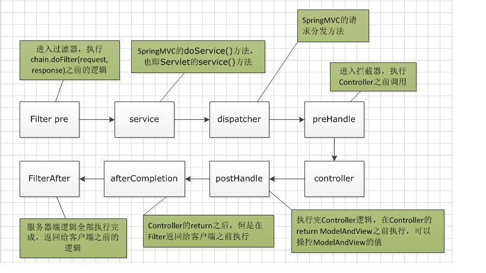

# 拦截器

## 概述

Spring MVC 也可以使用拦截器对请求进行拦截处理，用户可以自定义拦截器实现特定的功能。自定义的拦截器可以实现 `HandlerInterceptor` 接口，也可以继承 `HandlerInterceptorAdapter` 适配器类。

拦截器是一个工作流接口，允许自定义处理程序执行链。应用程序可以为某些处理程序组注册任意数量的现有或自定义拦截器，以添加常见的预处理行为，而无需修改每个处理程序实现。

在适当的 `HandlerAdapter` 触发处理程序本身的执行之前，将调用 `HandlerInterceptor`。该机制可以用于预处理方面的大领域，例如，用于授权检查或常见的处理程序行为，例如语言环境或主题更改。其主要目的是允许排除重复的处理程序代码。

过滤器和拦截器的区别参考：[Spring Boot 中，过滤器和拦截器的区别是什么？](http://www.javathings.top/springboot%E4%B8%AD%EF%BC%8C%E8%BF%87%E6%BB%A4%E5%99%A8%E5%92%8C%E6%8B%A6%E6%88%AA%E5%99%A8%E7%9A%84%E5%8C%BA%E5%88%AB%E6%98%AF%E4%BB%80%E4%B9%88%EF%BC%9F/)

`HandlerAdapter` 接口方法

参考：[Spring API](https://docs.spring.io/spring-framework/docs/current/javadoc-api/org/springframework/web/servlet/HandlerInterceptor.html)

1. `prehandle`：拦截处理程序的执行。**在 `HandlerMapping` 确定适当的处理程序对象之后**但**在 `HandlerAdapter` 调用处理程序之前**调用。如果执行链应继续下一个拦截器或处理程序本身，则为 `true`；否则，`DispatcherServlet` 假定此拦截器已经处理了响应本身。`DispatcherServlet` 处理执行链中的处理程序，该处理程序由任意数量的拦截器组成，处理程序本身位于末尾。每个拦截器都可以决定终止执行链，通常是发送 HTTP 错误或编写自定义响应。
2. `postHandle`：拦截处理程序的执行。**在 `HandlerAdapter` 实际调用处理程序之后**但**在 `DispatcherServlet` 呈现视图之前**调用；如果处理程序出现异常 ———— `HandlerAdapter` 没有正常运行也没有向 `DispatcherServlet` 呈现视图，因此不会调用 `postHandle` 方法。可以通过给定的 `ModelAndView` 向视图公开额外的模型对象。`DispatcherServlet` 处理执行链中的处理程序，该处理程序由任意数量的拦截器组成，处理程序本身位于末尾。**使用此方法，每个拦截器都可以对执行进行后处理，并以与执行链相反的顺序进行应用。**
3. `afterCompletion`：完成请求处理后（即渲染视图之后）的回调。**处理程序执行的任何结果（无论是否出现异常）都将被调用，从而允许适当的资源清理**。**注意：仅当此拦截器的 `preHandle` 方法成功完成并返回 `true` 时，才会调用它**！与 `postHandle` 方法一样，该方法将在链中的每个拦截器上以相反的顺序调用，因此第一个拦截器将是最后一个被调用。




## 拦截器源码

在 `doDispatcherServlet` 中通过 `getHandler` 获取请求映射的处理器执行链，处理器执行链由多个处理器拦截器和处理器组成。

```java
protected void doDispatch(HttpServletRequest request, HttpServletResponse response) throws Exception {
    HttpServletRequest processedRequest = request;
	HandlerExecutionChain mappedHandler = null;
    // ...

    try {
        ModelAndView mv = null;
        Exception dispatchException = null;

        try {
            // 获取请求映射对应的处理器执行链
            // 处理器执行链由多个处理器拦截器和处理器组成
            mappedHandler = getHandler(processedRequest);
            if (mappedHandler == null) {
                noHandlerFound(processedRequest, response);
                return;
            }

            // 确定当前请求的处理器适配器
            HandlerAdapter ha = getHandlerAdapter(mappedHandler.getHandler());

            // ...

            // 在处理实际调用之前执行 preHandle 并根据 preHandle 的返回值来决定是否调用处理器
            if (!mappedHandler.applyPreHandle(processedRequest, response)) {
                return;
            }

            // 处理器的实际调用
            mv = ha.handle(processedRequest, response, mappedHandler.getHandler());

            // ...

            // 处理器返回视图对象，此时调用 postHandle 方法并且该视图对象之后将交由 DispatcherServlet 进行呈现
            mappedHandler.applyPostHandle(processedRequest, response, mv);
        }
        catch (Exception ex) {
            dispatchException = ex;
        }
        catch (Throwable err) {
            dispatchException = new NestedServletException("Handler dispatch failed", err);
        }
        // processDispatchResult 负责呈现视图对象
        // 如果方法呈现之后没有异常会执行 triggerAfterCompletion 来调用 afterCompletion 方法
        processDispatchResult(processedRequest, response, mappedHandler, mv, dispatchException);
    }
    catch (Exception ex) {
        // 如果出现异常执行 afterCompletion 方法
        triggerAfterCompletion(processedRequest, response, mappedHandler, ex);
    }
    catch (Throwable err) {
        // 如果出现异常执行 afterCompletion 方法
        triggerAfterCompletion(processedRequest, response, mappedHandler,
                new NestedServletException("Handler processing failed", err));
    }
    // ...
}
```

## 拦截器拦截 DispatcherServlet 请求

```java
public class FirstInterceptor implements HandlerInterceptor {
    @Override
    public boolean preHandle(HttpServletRequest request, HttpServletResponse response, Object handler)
            throws Exception {
        System.out.println("FirstInterceptor preHandle");
        // 如果返回 false 后续的处理器和拦截器都不会执行
        return true;
    }

    @Override
    public void postHandle(HttpServletRequest request, HttpServletResponse response, Object handler,
            ModelAndView modelAndView) throws Exception {
        // 如果处理器调用出现异常，postHandle 不会执行
        System.out.println("FirstInterceptor postHandle");
    }

    @Override
    public void afterCompletion(HttpServletRequest request, HttpServletResponse response, Object handler, Exception ex)
            throws Exception {
        // 只要 preHandle 通过，afterCompletion 方法必执行
        System.out.println("FirstInterceptor afterCompletion");
    }
}
```

Spring MVC Context 配置默认拦截所有请求的拦截器

```xml
<mvc:interceptors>
    <bean class="xyz.zerxoi.interceptor.FirstInterceptor" ></bean>
    <!-- 要求拦截器类上添加注解 @Component 创建 Bean 对象 -->
    <!-- <ref bean="firstInterceptor" /> -->
</mvc:interceptors>
```

在使用 DispatcherServlet 处理请求时会包含如下输出内容

```log
[apache-tomcat-9.0.41]: FirstInterceptor preHandle
[apache-tomcat-9.0.41]: 处理器输出内容
[apache-tomcat-9.0.41]: FirstInterceptor postHandle
[apache-tomcat-9.0.41]: FirstInterceptor afterCompletion
```

## 自定义拦截方法

通过如下标签可以自定义拦截器拦截和排除的请求路径以及所使用拦截器的 Bean 对象。

```xml
<mvc:interceptors>
    <mvc:interceptor>
        <mvc:mapping path="" />
        <mvc:exclude-mapping path="" />
        <bean></bean>
        <!-- <ref /> -->
    </mvc:interceptor>
</mvc:interceptors>
```

## 拦截器的执行顺序

```java
public class SecondInterceptor implements HandlerInterceptor {
    @Override
    public boolean preHandle(HttpServletRequest request, HttpServletResponse response, Object handler)
            throws Exception {
        System.out.println("SecondInterceptor preHandle");
        return true;
    }

    @Override
    public void postHandle(HttpServletRequest request, HttpServletResponse response, Object handler,
            ModelAndView modelAndView) throws Exception {
        System.out.println("SecondInterceptor postHandle");
    }

    @Override
    public void afterCompletion(HttpServletRequest request, HttpServletResponse response, Object handler, Exception ex)
            throws Exception {
        System.out.println("SecondInterceptor afterCompletion");
    }
}
```

```xml
<mvc:interceptors>
    <bean class="xyz.zerxoi.interceptor.FirstInterceptor" ></bean>
    <bean class="xyz.zerxoi.interceptor.SecondInterceptor"></bean>
</mvc:interceptors>
```

`DispatcherServlet` 处理执行链 `HandlerExecutionChain` 由任意数量的拦截器和处理程序组成，处理程序本身位于末尾。在 `mvc:interceptors` 元素中设置拦截器的拦截顺序，`preHandle` 方法是按处理执行链中定义的拦截器顺序执行的，`postHadnle` 和 `afterCompletion` 以执行链中拦截器相反的顺序调用。

```log
[apache-tomcat-9.0.41]: FirstInterceptor preHandle
[apache-tomcat-9.0.41]: SecondInterceptor preHandle
[apache-tomcat-9.0.41]: SecondInterceptor postHandle
[apache-tomcat-9.0.41]: FirstInterceptor postHandle
[apache-tomcat-9.0.41]: SecondInterceptor afterCompletion
[apache-tomcat-9.0.41]: FirstInterceptor afterCompletion
```

### 源码解析

在 `DispatcherServlet` 的 `doDispatch` 方法中，处理器执行链 `mappedHandler` 会分别调用其 `mappedHandler.applyPreHandle`，`mappedHandler.applyPostHandle` 和 `mappedHandler.triggerAfterCompletion` 调用执行链中的拦截器中的 `preHandle`，`postHandle` 和 `afterCompletion` 方法。

```java
boolean applyPreHandle(HttpServletRequest request, HttpServletResponse response) throws Exception {
    for (int i = 0; i < this.interceptorList.size(); i++) {
        HandlerInterceptor interceptor = this.interceptorList.get(i);
        if (!interceptor.preHandle(request, response, this.handler)) {
            triggerAfterCompletion(request, response, null);
            return false;
        }
        this.interceptorIndex = i;
    }
    return true;
}
```

`applyPreHandle` 会按顺序执行处理器执行链中拦截器的 `preHandle` 方法，`interceptorIndex`  会记录最后一个 `preHandle` 返回 `true` 的拦截器的索引。

```java
void applyPostHandle(HttpServletRequest request, HttpServletResponse response, @Nullable ModelAndView mv)
        throws Exception {

    for (int i = this.interceptorList.size() - 1; i >= 0; i--) {
        HandlerInterceptor interceptor = this.interceptorList.get(i);
        interceptor.postHandle(request, response, this.handler, mv);
    }
}
```

如果执行了 `postHandle` 方法，则一定执行了所有的拦截器，`applyPostHandle` 会从最后一个拦截器一直指定到第一个拦截器。

```java
void triggerAfterCompletion(HttpServletRequest request, HttpServletResponse response, @Nullable Exception ex) {
    for (int i = this.interceptorIndex; i >= 0; i--) {
        HandlerInterceptor interceptor = this.interceptorList.get(i);
        try {
            interceptor.afterCompletion(request, response, this.handler, ex);
        }
        catch (Throwable ex2) {
            logger.error("HandlerInterceptor.afterCompletion threw exception", ex2);
        }
    }
}
```

`interceptorIndex` 记录了 `preHandle`  最后一个返回 `true` 的拦截器。`triggerAfterCompletion` 从最索引 `interceptorIndex` 拦截器一直执行到索引 0 的拦截器。