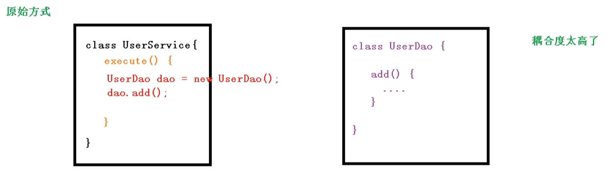
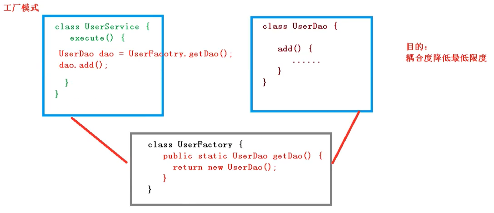
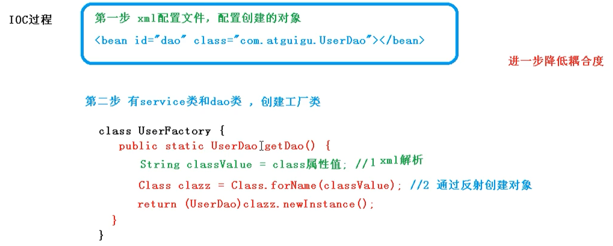

# IoC 容器

## 1 IoC 概念

**IoC（Inversion of Control）控制反转**，是面向对象编程中的一种设计原则，可以用来*降低计算机代码之间的耦合度*。IoC 把对象创建和对象之间的调用过程，交给 Spring 进行管理。

## 2 IoC 底层原理

三个核心技术：**XML 解析**，**工厂模式**，**反射**。







## 3 IoC 接口

IoC 思想基于 IoC 容器完成，IoC容器底层就是对象工厂。`org.springframework.beans` 和 `org.springframework.context` 包是Spring Framework 的 IoC 容器的基础。

### 3.1 `BeanFactory`

[Spring Framework Doc - The BeanFactory](https://docs.spring.io/spring-framework/docs/current/reference/html/core.html#beans-beanfactory)

`BeanFactory` 是 IoC 容器基本实现方式，是 Spring 内部使用的接口，不提供给开发人员使用

`BeanFactory` 是使用延迟加载形式来注入 Bean 的，即只有在使用到某个 Bean 时(调用 `getBean()` )，才对该 Bean 进行加载实例化。

为了验证上述说法，我们定义一个 `User` 类，在创建对象的时候向命令行输出语句。

```java
public class User {

    public User() {
        System.out.println("User is here");
    }
}
```

创建 XML 配置文件 `bean.xml`

```xml
<bean id="user" class="xyz.zerxoi.pojo.User"></bean>
```

使用 `BeanFactory` 的一个实现类 `XmlBeanFactory` 来加载配置文件。

```java
XmlBeanFactory beanFactory = new XmlBeanFactory(new ClassPathResource("bean.xml"));
System.out.println("=========================");
User user = beanFactory.getBean("user", User.class);
System.out.println(user);
```

输出结果

```
=========================
User is here
xyz.zerxoi.pojo.User@43c1b556
```

可以发现，对象创建确实在加载配置文件之后，对象在调用 `beanFactory.getBean("user", User.class)` 语句时才被创建出来。

需要注意的是 `XmlBeanFactory` 已经废弃了，可以用 `DefaultListableBeanFactory` 和 `XmlBeanDefinitionReader` 实现上述功能。

```java
DefaultListableBeanFactory beanFactory = new DefaultListableBeanFactory();
new XmlBeanDefinitionReader(beanFactory).loadBeanDefinitions("classpath:bean.xml");
System.out.println("=========================");
User user = beanFactory.getBean("user", User.class);
System.out.println(user);
```

### 3.2 `ApplicationContext`

`ApplicationContext` 是 `BeanFactory` 接口的子接口，提供更多更强大的功能，一般由开发人员进行使用。

`ApplicationContext` 是在容器启动时，一次性创建了所有的Bean。这样，在容器启动时，我们就可以发现 Spring 中存在的配置错误，这样有利于检查所依赖属性是否注入。 `ApplicationContext` 启动后预载入所有的单实例 Bean，通过预载入单实例 Bean ,确保当你需要的时候，你就不用等待，因为它们已经创建好了。

`ApplicationContext` 有常用子接口与实现类：
- `FileSystemXmlApplicationContext` 用于搜索文件系统中的 XML 文件
- `ClassPathXmlApplicationContext` 用于搜索 `classpath` 中的 XML 文件
- `ConfigurableApplicationContext` 可以包含一些拓展功能


```java
ClassPathXmlApplicationContext context = new ClassPathXmlApplicationContext("bean.xml");
System.out.println("=========================");
User user1 = context.getBean("user", User.class);
System.out.println(user1);
User user2 = context.getBean("user", User.class);
System.out.println(user2);
System.out.println(user1 == user2);
context.close();
```

根据输出结果可以看出，`ApplicationContext` 会在加载配置文件的时候就将 Bean 对象创建好了；创建的是一个单例的 Bean 对象，调用的两次 `context.getBean` 获取的都是同一个对象。

```
User is here
=========================
xyz.zerxoi.pojo.User@12a3153e
xyz.zerxoi.pojo.User@12a3153e
true
```

## 2 IoC操作（Bean 管理）

Bean管理指的是两个操作

- Spring 创建对象：将 Bean 对象的创建交给 Spring 来管理
- Spring 注入属性：设置 Bean 对象的属性值

Bean 管理操作有两种方式，分别是**基于 XML 配置文件的 Bean 管理**和**基于注解的 Bean 管理**。
