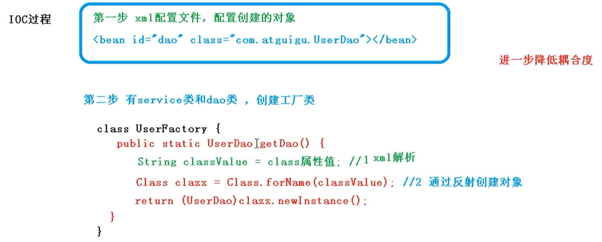

# IoC 容器

- IoC 底层原理
- BeanFactory 接口
- IoC 操作
    - 基于 XML
    - 基于注解

## 1 概念和原理

### 1.1 什么是 IoC

**IoC（Inversion of Control）控制反转**，是面向对象编程中的一种设计原则，可以用来*降低计算机代码之间的耦合度*。IoC 把对象创建和对象之间的调用过程，交给 Spring 进行管理。

### 1.2 IoC 底层原理

三个核心技术：**XML 解析**，**工厂模式**，**反射**。




### 1.3 IoC 接口

1. IoC 思想基于 IoC 容器完成，IoC容器底层就是对象工厂
2. Spring 提供了 IoC 容器实现的两种方式（两个接口）：
    1. `BeanFactory`：IoC容器基本实现方式，是 Spring 内部使用的接口，不提供给开发人员使用
        - 加载配置文件的时候不会创建对象，在获取（使用）对象时才会创建对象
    2. `ApplicationContext`：`BeanFactory` 接口的子接口，提供更多更强大的功能，一般由开发人员进行使用。
        - 加载配置文件的时候就会把配置文件对象进行创建
        - Web 项目对象的加载应该在启动阶段完成，所以一般使用 `ApplicationContext` 接口

`ApplicationContext` 有常用子接口与实现类：
- `FileSystemXmlApplicationContext` 用于搜索文件系统中的 XML 文件
- `ClassPathXmlApplicationContext` 用于搜索 `classpath` 中的 XML 文件
- `ConfigurableApplicationContext` 可以包含一些拓展功能


## 2 IoC操作（Bean 管理）

### 2.1 什么是 Bean 管理

Bean管理指的是两个操作

- Spring 创建对象：将 Bean 对象的创建交给 Spring 来管理
- Spring 注入属性：设置 Bean 对象的属性值

### 2.2 Bean 管理操作的两种方式

#### 基于 XML 配置文件方式实现

1. 基于 XML 方式创建对象
```xml
<bean id="user" class="xyz.zerxoi.spring.User"></bean>
```
在 Spring 配置文件中使用 `<bean>` 标签，在标签里添加对应属性就可以实现对象的创建。


`<bean>` 标签的属性：

- `id`：对象的唯一标识
- `class`：类的全路径

在创建对象时，默认是执行**无参数构造器**。

2. 基于 XML 方式注入属性

依赖注入（Dependency Injection，简称DI），就是注入属性


---

注入基本数据类型

**set方法**

创建类，定义属性及其 set 方法

```java
public class User {
    private String name;
    private Integer age;

    public void setName(String name) {
        this.name = name;
    }

    public void setAge(Integer age) {
        this.age = age;
    }

    public void speak() {
        System.out.println("Speaking");
    }
    
    @Override
    public String toString() {
        return "User [age=" + age + ", name=" + name + "]";
    }
}
```

在 Spring 配置文件中，先配置对象的创建，在配置属性的注入。

```xml
<bean id="user" class="xyz.zerxoi.spring.User">
    <!-- 
        使用 property 完成属性注入
            name：对象的属性名称
            value：向属性注入的值
        -->
    <property name="name" value="zerxoi"></property>
    <property name="age" value="23"></property>
</bean>
```

测试代码

```java
// 1. 加载 Spring 配置文件
ClassPathXmlApplicationContext context = new ClassPathXmlApplicationContext("bean.xml");
// 2. 获取配置创建的对象
User user = context.getBean("user", User.class);
System.out.println(user);
context.close();
```

输出结果

```
User [age=23, name=zerxoi]
```
**有参构造器**

创建一个带有有参构造器的类

```java
package xyz.zerxoi.spring;

public class Book {
    private String name;
    private String author;

    public Book(String name, String author) {
        this.name = name;
        this.author = author;
    }

    @Override
    public String toString() {
        return "Book [author=" + author + ", name=" + name + "]";
    }

}
```

有参构造器对象的 Spring 配置

```xml
<bean id="book" class="xyz.zerxoi.spring.Book">
    <!-- constructor-arg 用于传入构造器参数
            name 构造器参数名
            value 传递给构造器参数的值
        -->
    <constructor-arg name="name" value="狂人日记"></constructor-arg>
    <constructor-arg name="author" value="鲁迅"></constructor-arg>
    <!-- constructor-arg 也可以根据参数的索引来传入参数
            index 构造器参数名
            value 传递给指定构造器参数的值
        -->
    <!-- <constructor-arg index="0" value="狂人日记"></constructor-arg>
    <constructor-arg index="1" value="鲁迅"></constructor-arg> -->
</bean>
```

测试代码

```java
ClassPathXmlApplicationContext context = new ClassPathXmlApplicationContext("bean.xml");
Book book = context.getBean("book", Book.class);
System.out.println(book);
context.close();
```

测试结果

```
Book [author=鲁迅, name=狂人日记]
```

**p 命名空间**

set 方法的属性注入还可以使用 p 命名空间来注入，可以简化基于 XML 配置的方式

首先在配置文件中添加 `p` 命名空间

```xml
<beans xmlns="http://www.springframework.org/schema/beans" xmlns:p="http://www.springframework.org/schema/p" xmlns:xsi="http://www.w3.org/2001/XMLSchema-instance" xsi:schemaLocation="
        http://www.springframework.org/schema/beans http://www.springframework.org/schema/beans/spring-beans.xsd">
```

将 set 方法的 XML 配置文件可以修改为如下形式。其中 `p:{property}="{value}"` 来通过 set 方法将 `{property}` 属性修改为 `{value}`。

```xml
<bean id="user" class="xyz.zerxoi.spring.User" p:name="zerxoi" p:age="23">
</bean>
```

**XML 注入 `null` 空值**

将 `User` 修改为

```java
package xyz.zerxoi.spring;

public class User {
    private String name;
    private Integer age;
    private String address;

    public void setName(String name) {
        this.name = name;
    }

    public void setAge(Integer age) {
        this.age = age;
    }

    public void setAddress(String address) {
        this.address = address;
    }

    public void speak() {
        System.out.println("Speaking");
    }

    @Override
    public String toString() {
        return "User [address=" + address + ", age=" + age + ", name=" + name + "]";
    }
}
```

```xml
<bean id="user" class="xyz.zerxoi.spring.User">
    <property name="name" value="zerxoi"></property>
    <property name="age" value="23"></property>
    <!-- 将 address 属性设为空值 -->
    <property name="address">
        <null></null>
    </property>
</bean>
```

**XML 注入特殊值**

1. 转义字符（实体引用）

[XML与HTML字符实体引用列表](https://en.wikipedia.org/wiki/List_of_XML_and_HTML_character_entity_references)

使用如下配置，通过有参构造器为对象指定参数，将 `book` 对象的 `name` 指定为 `<<狂人日记>>`。可以通过实体引用 `&lt;` 对 `<` 进行转义，通过实体引用 `&gt;` 对 `>` 进行转义。

```xml
<bean id="book" class="xyz.zerxoi.spring.Book">
    <constructor-arg name="name" value="&lt;&lt;狂人日记&gt;&gt;"></constructor-arg>
    <constructor-arg name="author" value="鲁迅"></constructor-arg>
    <constructor-arg name="price" value="19.9"></constructor-arg>
</bean>
```

2. 使用 `<![CDATA[]]>`

`<![CDATA[]]>` 会对其中的内容进行转义

```xml
<bean id="user" class="xyz.zerxoi.spring.User">
    <property name="name" value="zerxoi"></property>
    <property name="age" value="23"></property>
    <property name="address" >
        <value><![CDATA[<<狂人日记>>]]></value>
    </property>
</bean>
```

---

注入 Bean 对象

**注入外部 Bean**

建立 `UserDao` 接口及其实现类 `UserDaoImpl`。

```java
package xyz.zerxoi.dao;

import xyz.zerxoi.pojo.User;

public interface UserDao {
    public User selectUser(); 
}
```

```java
import xyz.zerxoi.pojo.User;

public class UserDaoImpl implements UserDao {
    @Override
    public User selectUser() {
        User user = new User();
        user.setAddress("China");
        user.setAge(18);
        user.setAddress("高中生");
        return user;
    }
}
```
同时建立 `UserService` 接口。

```java
package xyz.zerxoi.service;

public interface UserService {
    public void showUser();
}
```

传统的 `UserService` 接口的实现类应该是如下形式的

```java
package xyz.zerxoi.service.impl;

import xyz.zerxoi.dao.UserDao;
import xyz.zerxoi.dao.impl.UserDaoImpl;
import xyz.zerxoi.pojo.User;
import xyz.zerxoi.service.UserService;

public class UserServiceImpl implements UserService {

    @Override
    public void showUser() {
        // 在 Service 中创建 Dao 对象并调用
        UserDao userDao = new UserDaoImpl();
        User user =  userDao.selectUser();
        System.out.println(user);
    }
}
```

在 Spring 配置文件中进行配置，首先需要在配置文件中创建 `Service` 和 `Dao` 对象，再将 `Dao` 对象注入到 `Service` 对象中，可以使用 set 方法注入也可以使用有参构造器注入。

因此首先再代码中创建 `Dao` 类型的属性，并声称其对应的 set 方法。

```java
package xyz.zerxoi.service.impl;

import xyz.zerxoi.dao.UserDao;
import xyz.zerxoi.pojo.User;
import xyz.zerxoi.service.UserService;

public class UserServiceImpl implements UserService {
    private UserDao userDao;

    public void setUserDao(UserDao userDao) {
        this.userDao = userDao;
    }

    @Override
    public void showUser() {
        User user =  userDao.selectUser();
        System.out.println(user);
    }
}
```

Spring 中配置，将 `Dao` 对象注入到 `Service` 对象中

```xml
<?xml version="1.0" encoding="UTF-8"?>
<beans xmlns="http://www.springframework.org/schema/beans" xmlns:p="http://www.springframework.org/schema/p" xmlns:xsi="http://www.w3.org/2001/XMLSchema-instance" xsi:schemaLocation="
        http://www.springframework.org/schema/beans http://www.springframework.org/schema/beans/spring-beans.xsd">
    <bean id="userService" class="xyz.zerxoi.service.impl.UserServiceImpl">
        <!-- 将 userDao 注入到 userService 的 userDao 属性中
                name：对象的属性名
                ref：Spring 创建的对象的 id 属性
         -->
        <property name="userDao" ref="userDao"></property>
    </bean>
    <bean id="userDao" class="xyz.zerxoi.dao.impl.UserDaoImpl">

    </bean>
</beans>
```

```java
@Test
public void userServiceTest() {
    ClassPathXmlApplicationContext context = new ClassPathXmlApplicationContext("bean1.xml");
    UserService userService = context.getBean("userService", UserService.class);
    userService.showUser();
    context.close();
}
```

**内部 Bean**

一对多关系：部门和员工，一个部门有多个员工，一个员工属于一个部门。

在实体类执行表示一对多关系，员工表示所属部门，使用对象类型进行标识。

```java
package xyz.zerxoi.pojo;

public class Dept {
    private String name;

    public void setName(String name) {
        this.name = name;
    }
}
```

```java
package xyz.zerxoi.pojo;

import java.math.BigDecimal;

public class Emp {
    private String name;
    private BigDecimal salary;
    // 员工属于某一个部门，适用对象形式表示
    private Dept dept;

    public void setName(String name) {
        this.name = name;
    }

    public void setSalary(BigDecimal salary) {
        this.salary = salary;
    }
    
    public void setDept(Dept dept) {
        this.dept = dept;
    }
}
```

Spring XML 配置

```xml
<bean id="emp" class="xyz.zerxoi.pojo.Emp">
    <property name="name" value="Tohru"></property>
    <property name="salary" value="3500"></property>
    <property name="dept">
        <bean id="dept" class="xyz.zerxoi.pojo.Dept">
            <property name="name" value="Sales"></property>
        </bean>
    </property>
</bean>
```

测试代码

```java
ClassPathXmlApplicationContext context = new ClassPathXmlApplicationContext("bean2.xml");
Emp emp = context.getBean("emp", Emp.class);
System.out.println(emp);
context.close();
```


**级联赋值**

```xml
<bean id="dept" class="xyz.zerxoi.pojo.Dept">
    <property name="name" value="sales"></property>
</bean>
<bean id="emp" class="xyz.zerxoi.pojo.Emp">
    <property name="name" value="Tohru"></property>
    <property name="salary" value="3500"></property>
    <property name="dept" ref="dept"></property>
    <property name="dept.name" value="Accouting"></property>
</bean>
```

要想修改 `emp` 对象 `dept` 属性的 `name`属性，就要获取 `dept` 的属性，Spring 会通过属性的 get 方法获取该属性，所以我们为 `dept` 定义 get 方法。

```java
package xyz.zerxoi.pojo;

import java.math.BigDecimal;

public class Emp {
    private String name;
    private BigDecimal salary;
    // 员工属于某一个部门，适用对象形式表示
    private Dept dept;

    public Dept getDept() {
        return dept;
    }

    public void setName(String name) {
        this.name = name;
    }

    public void setSalary(BigDecimal salary) {
        this.salary = salary;
    }
    
    public void setDept(Dept dept) {
        this.dept = dept;
    }

    @Override
    public String toString() {
        return "Emp [dept=" + dept + ", name=" + name + ", salary=" + salary + "]";
    }
}
```

---

**注入可迭代属性**

```java
package xyz.zerxoi.pojo;

import java.util.List;
import java.util.Map;
import java.util.Set;

public class Iterable {
    private String[] array;
    private List<String> list;
    private Map<String, String> map;
    private Set<String> set;

    public void setArray(String[] array) {
        this.array = array;
    }

    public void setList(List<String> list) {
        this.list = list;
    }

    public void setMap(Map<String, String> map) {
        this.map = map;
    }

    public void setSet(Set<String> set) {
        this.set = set;
    }
}
```

```xml
<bean id="iterable" class="xyz.zerxoi.pojo.MyIterable">
    <property name="array">
        <array>
            <value>ukpkmkk</value>
            <value>wdnmd</value>
        </array>
    </property>
    <property name="list">
        <list>
            <value>火化</value>
            <value>呀吼</value>
        </list>
    </property>
    <property name="map">
        <map>
            <entry key="wdnmd" value="唯独你不懂"></entry>
            <entry key="yyds" value="永远的神"></entry>
        </map>
    </property>
    <property name="set">
        <set>
            <value>Java</value>
            <value>Golang</value>
        </set>
    </property>
</bean>
```

**集合属性对象注入**

```java
package xyz.zerxoi.pojo;

import java.util.Arrays;
import java.util.List;
import java.util.Map;
import java.util.Set;

public class MyIterable {
    private Dept[] array;
    private List<Dept> list;
    private Map<String, Dept> map;
    private Set<Dept> set;

    public void setArray(Dept[] array) {
        this.array = array;
    }

    public void setList(List<Dept> list) {
        this.list = list;
    }

    public void setMap(Map<String, Dept> map) {
        this.map = map;
    }

    public void setSet(Set<Dept> set) {
        this.set = set;
    }
    
    @Override
    public String toString() {
        return "Iterable [array=" + Arrays.toString(array) + ", list=" + list + ", map=" + map + ", set=" + set + "]";
    }
}
```

```xml
<bean id="iterable" class="xyz.zerxoi.pojo.MyIterable">
    <property name="array">
        <array>
            <ref bean="accouting" />
            <ref bean="sales" />
        </array>
    </property>
    <property name="list">
        <list>
            <ref bean="accouting" />
            <ref bean="sales" />
        </list>
    </property>
    <property name="map">
        <map>
            <entry key="wdnmd" value-ref="accouting"></entry>
            <entry key="yyds" value-ref="sales"></entry>
        </map>
    </property>
    <property name="set">
        <set>
            <ref bean="accouting" />
            <ref bean="sales" />
        </set>
    </property>
</bean>
<bean id="accouting" class="xyz.zerxoi.pojo.Dept">
    <property name="name" value="accouting"></property>
</bean>
<bean id="sales" class="xyz.zerxoi.pojo.Dept">
    <property name="name" value="sales"></property>
</bean>
```

**集合注入的提取**

在 Spring 配置文件中引入命名空间 `uitl`

```xml
<beans xmlns="http://www.springframework.org/schema/beans" xmlns:p="http://www.springframework.org/schema/p" xmlns:util="http://www.springframework.org/schema/util" xmlns:xsi="http://www.w3.org/2001/XMLSchema-instance" xsi:schemaLocation="
        http://www.springframework.org/schema/beans http://www.springframework.org/schema/beans/spring-beans.xsd http://www.springframework.org/schema/util http://www.springframework.org/schema/beans/spring-util.xsd">
```

提取 List 结合类型属性注入

```xml
<bean id="accouting" class="xyz.zerxoi.pojo.Dept">
    <property name="name" value="accouting"></property>
</bean>
<bean id="sales" class="xyz.zerxoi.pojo.Dept">
    <property name="name" value="sales"></property>
</bean>
<util:list id="deptList">
    <ref bean="accouting" />
    <ref bean="sales" />
</util:list>
```

提取 List 集合类型属性注入的使用

```xml
<property name="list" ref="deptList"></property>
```

---

**FactoryBean（工厂Bean）**

Spring 有两种类型的 Bean，一种是普通 Bean，另一种是工厂Bean（`FactoryBean`）。

在配置文件中，普通 Bean 中定义的类型就是返回类型，而工厂 Bean 定义的类型可以和返回类型不一样。

通过实现 FactoryBean 接口创建一个工厂类，接口中实现的方法定义了返回的Bean的类型。

```java
package xyz.zerxoi.pojo;

import org.springframework.beans.factory.FactoryBean;

public class MyBean implements  FactoryBean<Dept> {

    @Override
    public Dept getObject() throws Exception {
        Dept dept = new Dept();
        dept.setName("sales");
        return dept;
    }

    @Override
    public Class<?> getObjectType() {
        return Dept.class;
    }
}
```

```xml
<bean id="factorybean" class="xyz.zerxoi.pojo.MyBean"></bean>
```

```java
ClassPathXmlApplicationContext context = new ClassPathXmlApplicationContext("factorybean.xml");
Dept bean = context.getBean("factorybean", Dept.class);
System.out.println(bean);
context.close();
```

---

Bean 的多实例

在 Spring 里，可以设置创建 Bean 实例是单实例还是多实例。

Spring 在默认情况下是单实例，如下测试代码返回的内容是 `true`。

```xml
<?xml version="1.0" encoding="UTF-8"?>
<beans xmlns="http://www.springframework.org/schema/beans" xmlns:xsi="http://www.w3.org/2001/XMLSchema-instance" xsi:schemaLocation="
        http://www.springframework.org/schema/beans http://www.springframework.org/schema/beans/spring-beans.xsd">
    <!-- 通过设置 bean 标签的 scope 属性来设置对象是单例对象还是多例对象 -->
    <!-- scope 属性有多个的值，主要的是 singleton(默认值) 和 prototype -->
    <!-- 单实例对象 -->
    <bean id="bean1" class="xyz.zerxoi.pojo.MyBean" ></bean>
    <!-- 多实例对象 -->
    <bean id="bean2" class="xyz.zerxoi.pojo.MyBean" scope="prototype"></bean>
</beans>
```

```java
ClassPathXmlApplicationContext context = new ClassPathXmlApplicationContext("prototypescope.xml");
Dept bean1 = context.getBean("bean1", Dept.class);
Dept bean2 = context.getBean("bean1", Dept.class);
System.out.println(bean1 == bean2);
bean1 = context.getBean("bean2", Dept.class);
bean2 = context.getBean("bean2", Dept.class);
System.out.println(bean1 == bean2);
context.close();
```

`singleton` 和 `prototype` 的区别：

1. `singleton` 表示单实例，而 `prototype` 表示多实例
2. `singleton` 是在加载 Spring 配置文件时就会创建的单实例对象；`prototype` 不是在加载 Spring 配置文件时创建对象，而是在调用 `getBean` 方法的时候创建多实例对象。

---

Bean 的生命周期

生命周期：对象从创建到销毁的过程

1. 通过构造器创建 Bean 实例（无参构造器）
2. 为 Bean 的属性设置值和对其他 Bean 的引用（调用 set 方法）
3. 调用 Bean 的初始化的方法（需要手动配置初始化方法）
4. Bean 就可以使用了（对象获取到了）
5. 当容器关闭时候，调用 Bean 的销毁方法（需要手动配置销毁的方法）

Bean 生命周期演示

```xml
<bean id="lifecycle" class="xyz.zerxoi.pojo.LifeCycle" init-method="initMethod" destroy-method="destroyMethod">
    <property name="name">
        <value>bar</value>
    </property>
</bean>
```

```java
package xyz.zerxoi.pojo;

public class LifeCycle {
    private String foo;

    public LifeCycle() {
        System.out.println("1. 调用无参构造创建 Bean 实例");
    }

    public void setFoo(String foo) {
        System.out.println("2. 调用 set 方法设置对象属性");
        this.foo = foo;
    }

    public void initMethod() {
        System.out.println("3. 调用初始化方法");
    }

    public void destroyMethod() {
        System.out.println("5. 调用销毁方法");
    }   
}
```

```java
ClassPathXmlApplicationContext context = new ClassPathXmlApplicationContext("lifecycle.xml");
Emp bean = context.getBean("emp", Emp.class);
System.out.println("4. 获取 Bean 对象 " + bean);
// 容器关闭，调用销毁方法
context.close();
```

输出结果

```
1. 调用无参构造创建 Bean 实例
2. 调用 set 方法设置对象属性
3. 调用初始化方法
4. 获取 Bean 对象 xyz.zerxoi.pojo.LifeCycle@2034b64c
5. 调用销毁方法
```
---
**后期处理器（BeanPostProcessor）**

在加入 Bean 的后置处理器之后，Bean 的生命周期一共有 7 步操作。

1. 通过构造器创建 Bean 实例（无参构造器）
2. 为 Bean 的属性设置值和对其他 Bean 的引用（调用 set 方法）
3. **Bean 实例初始化前后期处理**
4. 调用 Bean 的初始化的方法（需要手动配置初始化方法）
5. **Bean 实例初始化后后期处理**
6. Bean 就可以使用了（对象获取到了）
7. 当容器关闭时候，调用 Bean 的销毁方法（需要手动配置销毁的方法）


定义后期处理器

```java
public class MyBeanPostProcessor implements BeanPostProcessor {
    @Override
    public Object postProcessBeforeInitialization(Object bean, String beanName) throws BeansException {
        System.out.println("Bean 实例初始化前后期处理");
        return BeanPostProcessor.super.postProcessBeforeInitialization(bean, beanName);
    }

    @Override
    public Object postProcessAfterInitialization(Object bean, String beanName) throws BeansException {
        System.out.println("Bean 实例初始化后后期处理");
        return BeanPostProcessor.super.postProcessAfterInitialization(bean, beanName);
    }
}
```

配置后期处理器实例

```xml
<!-- 配置并创建后期处理器（该类实现 BeanPostProcessor 接口） -->
<!-- 后期处理器会对当前配置文件的所有 Bean 都添加都只处理器的处理 -->
<bean id="myBeanPostProcessor" class="xyz.zerxoi.pojo.MyBeanPostProcessor"></bean>
```

测试用例

```java
ClassPathXmlApplicationContext context = new ClassPathXmlApplicationContext("lifecycle.xml");
LifeCycle bean = context.getBean("lifecycle", LifeCycle.class);
System.out.println("4. 获取 Bean 对象 " + bean);
context.close();
```

输出结果

```
1. 调用无参构造创建 Bean 实例
2. 调用 set 方法设置对象属性
Bean 实例初始化前后期处理
3. 调用初始化方法
Bean 实例初始化后后期处理
4. 获取 Bean 对象 xyz.zerxoi.pojo.LifeCycle@2034b64c
5. 调用销毁方法
```

---

XML 自动装配

自动装配：根据指定装配规则（属性名称或者属性类型），Spring自动将匹配的属性值进行注入

`autowire="byName"` 会将 `id` 属性为 `emp` 的 Bean 对象配置为根据属性名称自动装配，Spring 会自动查找 `id` 属性和 `emp` 对象属性名相同的 Bean，并把它注入到该属性中。

如下配置就是将 `id` 属性为 `dept` 的 Bean 对象注入到 `emp` 对象的 `dept` 属性中。

```xml
<bean id="emp" class="xyz.zerxoi.pojo.Emp" autowire="byName"></bean>
<bean id="dept" class="xyz.zerxoi.pojo.Dept">
    <property name="name" value="Sales"></property>
</bean>
```

测试代码

```java
ClassPathXmlApplicationContext context = new ClassPathXmlApplicationContext("autoWire.xml");
Emp bean = context.getBean("emp", Emp.class);
System.out.println(bean);
context.close();
```

输出结果

```
Emp [dept=Dept [name=Sales], name=null, salary=null]
```

`autowire="byType"` 可以根据属性类型来自动装配，Spring 会自动查找`class` 属性和 Bean 属性类型相同的 Bean 对象，并将其注入到该属性当中。

`id` 属性为 `emp` 的 Bean 对象中有一个类型为 `xyz.zerxoi.pojo.Dept` 的属性，Spring 会查找 `class` 属性值和 `xyz.zerxoi.pojo.Dept` 相同的 Bean 对象，将其注入到 `emp` 对象中。

```xml
<bean id="emp" class="xyz.zerxoi.pojo.Emp" autowire="byType"></bean>
<bean id="dept" class="xyz.zerxoi.pojo.Dept">
    <property name="name" value="Sales"></property>
</bean>
```

结果和上面的根据属性名注入一样。

但是如果有多个类型为 `xyz.zerxoi.pojo.Dept` 的对象，则会报错。

```xml
<bean id="emp" class="xyz.zerxoi.pojo.Emp" autowire="byType"></bean>
<bean id="dept" class="xyz.zerxoi.pojo.Dept">
    <property name="name" value="Sales"></property>
</bean>
<bean id="dept2" class="xyz.zerxoi.pojo.Dept">
    <property name="name" value="Sales"></property>
</bean>
```

错误输出如下

```
NoUniqueBeanDefinitionException: No qualifying bean of type 'xyz.zerxoi.pojo.Dept' available: expected single matching bean but found 2: dept,dept2
```

---

外部属性文件

直接配置 druid 连接池，需要注意的是 `com.alibaba.druid.pool.DruidDataSource` 类的父类 `com.alibaba.druid.pool.DruidAbstractDataSource` 拥有 `driverClassName`、`url`、`username` 和 `passwrod` 属性及其 set 方法，可以通过 `property` 对其进行设置来配置 druid 连接池。  

```xml
<bean id="dataSource" class="com.alibaba.druid.pool.DruidDataSource">
    <property name="driverClassName" value="com.mysql.cj.jdbc.Driver"></property>
    <property name="url" value="jdbc:mysql://localhost:3306/mybatis"></property>
    <property name="username" value="root"></property>
    <property name="password" value="6019"></property>
</bean>
```

引入外部属性文件配置数据库连接池

1. 创建外部属性 `properties` 文件，写入数据库信息

```properties
prop.driverClass=com.mysql.cj.jdbc.Driver
prop.url=jdbc:mysql://localhost:3306/mybatis
prop.username=root
prop.password=6019
```

2. 把外部 properties 属性文件引入到 Spring 配置文件中

引入 context 命名空间

```xml
<beans xmlns="http://www.springframework.org/schema/beans" xmlns:context="http://www.springframework.org/schema/context" xmlns:xsi="http://www.w3.org/2001/XMLSchema-instance" xsi:schemaLocation="
        http://www.springframework.org/schema/beans http://www.springframework.org/schema/beans/spring-beans.xsd http://www.springframework.org/schema/context http://www.springframework.org/schema/context/spring-context.xsd">
```

在 Spring 配置文件中使用标签引入外部属性文件

[spring配置文件引入properties文件：<context:property-placeholder>标签使用总结](https://www.cnblogs.com/javahr/p/8376742.html)

https://developer.aliyun.com/article/66695

`classpath` 和 `classpath*` 的区别

https://blog.csdn.net/qq_30038111/article/details/82116559
https://blog.csdn.net/kkdelta/article/details/5507799

```xml
<context:property-placeholder location="classpath:druid.properties"/>
<bean id="dataSource" class="com.alibaba.druid.pool.DruidDataSource">
    <property name="driverClassName" value="${prop.driverClass}"></property>
    <property name="url" value="${prop.url}"></property>
    <property name="username" value="${prop.username}"></property>
    <property name="password" value="${prop.password}"></property>
</bean>
```

也可以不使用 context  命名空间，可以使用 `org.springframework.beans.factory.config.PropertyPlaceholderConfigurer` 类来创建一个对象来替代 `context:property-placeholder` 标签。

```xml
<bean id="propertyConfigurer" class="org.springframework.beans.factory.config.PropertyPlaceholderConfigurer">
    <property name="location" value="classpath:druid.properties" />
</bean>
```

测试代码

```java
ClassPathXmlApplicationContext context = new ClassPathXmlApplicationContext("externalProperties.xml");
DataSource bean = context.getBean("dataSource", DataSource.class);
Connection conn = bean.getConnection();
PreparedStatement ps = conn.prepareStatement("select * from t_author");
ResultSet rs = ps.executeQuery();
while (rs.next()) {
    System.out.println(rs.getString("username"));
}
conn.close();
context.close();
```
