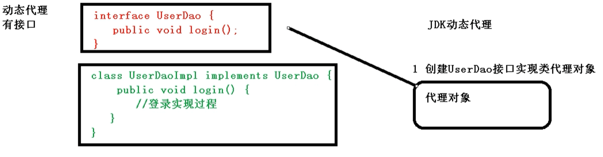
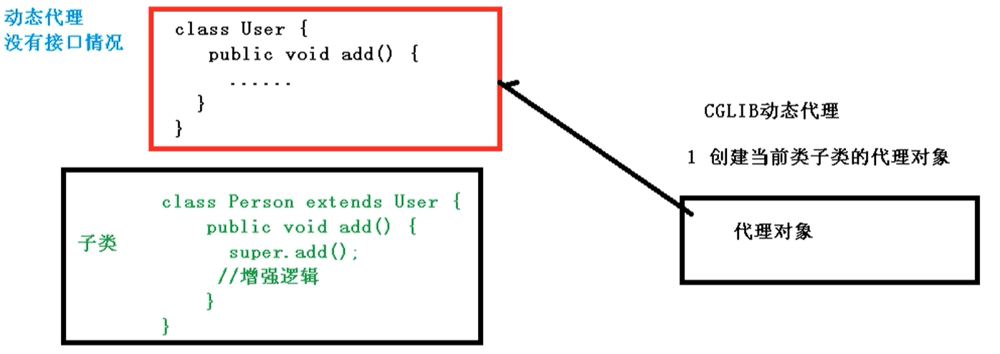

# AOP

## 1 概念

在计算中，面向方面编程（AOP）是一种编程范例，旨在通过分离横切关注点来增加模块性。它通过在不修改代码本身的情况下向现有代码添加其他行为来实现。

- 它通过单独指定**切入点**规范修改哪些代码，例如“当函数名称以`set`开头时记录所有函数调用”。
- 这允许行为不是业务逻辑的核心 （例如日志记录）要添加到程序中而不会使核心功能的代码混乱。

AOP构成了面向方面的软件开发的基础。

---

AOP（Aspect Oriented Programming），意为面向切面编程，利用 AOP 可以对业务逻辑的各个部分进行隔离，从而使得业务逻辑各个部分之间的耦合度降低，提高程序的可重用性，同时提高了开发的效率。

不通过修改源代码的方式，在主干功能里面添加新功能。

使用登录的例子说明 AOP：


## 2 Java的三种代理模式(Spring动态代理对象)底层原理

[Java的三种代理模式(Spring动态代理对象)](https://www.cnblogs.com/qlqwjy/p/7550609.html)

AOP 底层使用动态代理

1. 有接口情况，使用 JDK 动态代理

创建接口实现类的代理对象，增强类的方法 



2. 没有接口情况，使用 CGLIB 动态代理

创建子类的代理对象，增强类的方法。



### AOP （JDK 动态代理）

参考：[Zerxoi/JavaProject 动态代理](https://github.com/Zerxoi/JavaProject/blob/main/src/xyz/zerxoi/dynamic/%E5%8A%A8%E6%80%81%E4%BB%A3%E7%90%86.md)

使用 JDK 动态代理，使用 `java.lang.reflect.Proxy` 类里面的 `newProxyInstance` 方法创建代理对象。

```java
Object java.lang.reflect.Proxy.newProxyInstance(ClassLoader loader, Class<?>[] interfaces, InvocationHandler h)
```

`newProxyInstance` 有三个参数

- `loder`：所有的指定的接口类型，指定接口的所有公共方法签名引用的所有类型，以及父接口继承的所有类型，必须通过指定的**类加载器**按名称可见
- `interfaces`：代理类要实现的**接口列表**
- `h`：要向其分派方法调用的**调用处理程序**，即调用代理实例的方法时，会调用 `InvocationHandler` 实现类的 `invoke` 方法来进行分配

---

调用代理实例的方法时，会调用 `InvocationHandler` 实现的调用处理程序的 `invoke` 方法来进行分配。如果我们将代理类的方法的调用分配给被代理类对应的方法，就可实现动态代理。


```java
public Object invoke(Object proxy, Method method, Object[] args)
```

`invoke` 方法有3个参数：

- `proxy`：代理类对象
- `method`：代理类对象调用的方法
- `args`：代理类对象调用的方法的参数

```java
class MyInvocationHandler implements InvocationHandler {
    // 被代理对象
    private Object obj;

    public MyInvocationHandler(Object obj) {
        this.obj = obj;
    }

    @Override
    public Object invoke(Object proxy, Method method, Object[] args) throws Throwable {
        System.out.println("代理类对象的方法分配给被代理类对象之前");
        // 将代理类对象的方法分配给被代理类对象
        Object result = method.invoke(obj, args);
        System.out.println("代理类对象的方法分配给被代理类对象之后");
        return result;
    }
}
```

---

创建一个 `UserDao` 接口及其实现类。

```java
interface UserDao {
    public void insert(String username);
}

class UserDaoImpl implements UserDao {
    @Override
    public void insert(String username) {
        System.out.println("添加用户" + username);
    }
}
```

创建被代理对象 `userDao` 的代理实例对象 `proxy` 并调用其 `insert` 方法。该方法会调用 **调用处理器 `handler`** 的 `invoke` 方法，`invoke` 会将代理实例的方法分配给被代理对象的同名方法。

```java
public class JdkProxyTest {
    @Test
    public void jdkProxyTest() {
        UserDao userDao = new UserDaoImpl();
        InvocationHandler handler = new MyInvocationHandler(userDao);
        UserDao proxy = (UserDao)Proxy.newProxyInstance(userDao.getClass().getClassLoader(), userDao.getClass().getInterfaces(), handler);
        proxy.insert("zerxoi");
    }
}
```

结果如下

```
代理类对象的方法分配给被代理类对象之前
添加用户zerxoi
代理类对象的方法分配给被代理类对象之后
```

## AOP 术语

[Spring AOP(一) AOP基本概念](https://zhuanlan.zhihu.com/p/60842627)

[AOP Concepts](https://docs.spring.io/spring-framework/docs/current/reference/html/core.html#aop-introduction-defn)

1. 切面（Aspect）:要添加在方法某处的，横跨多个类的模块功能。例如事务管理就是一个很好的例子，该功能可能要添加到多个模块的多个方法中，来添加事务管理逻辑功能。切面由两部分组成：
    - 功能添加在哪个方法（接入点）上要由**切入点**来描述
    - 添加功能的具体操作和添加在切入点前还是后需要由**通知**决定
2. 连接点（Join point）：被增强的业务方法对象；在 Advice 中可以通过 `JoinPoint` 参数获取其增强的业务方法对象。
3. 切入点（Pointcut）：用于匹配连接点（Join point）的谓词；切入点表达式，限定连接点（被增强的业务方法）的范围。
4. 通知（Advice）：在特定的连接点处采取的操作，该操作的位置可以根据通知的类型来决定。
    - **前置通知**：`@Before`
    - **后置通知**：`@AfterReturning`（不发生异常时执行）
    - **异常通知**：`@AfterThrowing`（发生异常时执行）
    - **最终通知**：`@After`（无论是否发生异常都会执行）
    - **环绕通知**：`@Around`（最外层环绕）
5. 目标对象（Target Object）：一个或多个切面通知的对象。也称为“被通知对象（advised Object）”。由于Spring AOP是使用动态代理实现的，因此该对象是被代理对象。
6. AOP 代理：**切面的实现**；由AOP框架创建的对象，以便实现切面的规约(通知方法执行等)。在Spring框架中，AOP代理是JDK动态代理或CGLIB代理。
7. 顾问（Advisor）：顾问就像一个切面的子集，只有一条通知。通知本身由Bean表示，并且必须实现Spring的[建议类型](https://docs.spring.io/spring-framework/docs/current/reference/html/core.html#aop-api-advice-types)中描述的建议接口之一。

---

1. Spring 框架一般都是基于 AspectJ 实现 AOP 操作。

AspectJ 不是 Spring 组成部分，独立于 AOP 框架，一般把 AspectJ 和 Spring 框架一起使用，进行 AOP 操作。

2. 基于 AspectJ 实现 AOP 操作：
    
    1. 基于 XML 配置文件实现
    2. 基于注解方式实现（常用）

3. 在项目工程里面引入 AOP 相关依赖

Maven 导入 `spring-aspects` 即可，该包依赖于 `aspectjweaver.jar`。

4. 切入点表达式

参考：

[AOP Pointcuts Examples](https://docs.spring.io/spring-framework/docs/current/reference/html/core.html#aop-pointcuts-examples)

[Pointcuts](https://www.eclipse.org/aspectj/doc/released/progguide/semantics-pointcuts.html)

---

切入点表达式作用：知道对那个类里面的哪个方法进行增强

表达式组成

```
execution(modifiers-pattern? ret-type-pattern declaring-type-pattern? name-pattern(param-pattern) throws-pattern?)
```

除了返回类型模式（`ret-type-pattern`），名称模式和参数模式以外的所有部分都是可选的。

**返回类型模式**确定该方法的返回类型必须是什么才能使连接点匹配。最常见的是，您将使用 `*` 作为返回类型模式，该模式与任何返回类型匹配。只有当方法返回给定类型时，一个完全限定的类型名才会匹配。

如果你指定了一个**声明类型模式**，请在后面加上 `.` 来连接到名称模式组件。

**名称模式**与方法名称匹配。您可以使用 `*` 通配符作为名称模式的全部或部分。

**参数模式**稍微复杂一些：`()` 匹配不带参数的方法，而 `(..)` 匹配任意数量的参数（零个或多个）。模式 `(*)` 匹配采用任何类型的一个参数的方法，`(*, String)` 匹配采用两个参数的方法，第一个可以是任何类型，第二个必须是String。

---

语法结构

```
execution(MethodPattern)

MethodPattern = 
  [ModifiersPattern] TypePattern 
        [TypePattern . ] IdPattern (TypePattern | ".." , ... ) 
        [ throws ThrowsPattern ]
ThrowsPattern = 
  [ ! ] TypePattern , ...
TypePattern = 
    IdPattern [ + ] [ [] ... ]
    | ! TypePattern
    | TypePattern && TypePattern
    | TypePattern || TypePattern
    | ( TypePattern )  
IdPattern =
  Sequence of characters, possibly with special * and .. wildcards
ModifiersPattern =
  [ ! ] JavaModifier  ...
```

类型模式（`TypePattern`）中有有多种类型模式

1. 准确类型模式（Exact type pattern）

如果类型模式是精确类型（不包含通配符）则匹配的工作方式类似于Java中的普通类型查找

2. **类型名称模式（Type name patterns）**

有一个特殊的类型名称 `*`，它也是一种类型模式。`*` 选择所有类型，包括原始类型。

类型名称中可以包含两种通配符，分别是 `*` 和 `..`

- 通配符 `*` 匹配零个或多个字符（`.` 除外），因此，当类型具有某种命名约定时，可以使用通配符。
- 通配符 `..` 匹配以 `.` 开头和结尾的任何字符序列，因此可用于选择任何子包中的所有类型或所有内部类型。

3. **子类型模式（Subtype patterns）**

通配符 `+` 可以选择类型（或类型集合）的所有子类型。通配符 `+` 跟随在类型名称模式的后面。

4. **数组类型模式（Array type patterns）**

类型名称模式或子类型模式可以后跟一组或多组方括号以构成数组类型模式。

5. **类型模式（Type Patterns）**

类型模式由**类型名称模式**，**子类型模式**和**数组类型模式**组成，并使用布尔运算符 `&&`，`||` 和 `!` 构造。

## AOP操作（AspectJ 注解）

1. 编写 Spring 配置文件

添加 `aop` 命名空间和 `context` 命名空间

```xml
<beans xmlns="http://www.springframework.org/schema/beans"
    xmlns:xsi="http://www.w3.org/2001/XMLSchema-instance"
    xmlns:context="http://www.springframework.org/schema/context"
    xmlns:aop="http://www.springframework.org/schema/aop"
    xsi:schemaLocation="
        http://www.springframework.org/schema/beans http://www.springframework.org/schema/beans/spring-beans.xsd
        http://www.springframework.org/schema/context http://www.springframework.org/schema/context/spring-context.xsd
        http://www.springframework.org/schema/aop http://www.springframework.org/schema/aop/spring-aop.xsd">
```

扫描 `xyz.zerxoi` 包下的注解

```xml
<context:component-scan base-package="xyz.zerxoi"></context:component-scan>
```

开启 AspectJ 自动生成代理对象

[Enabling @AspectJ Support](https://docs.spring.io/spring-framework/docs/current/reference/html/core.html#aop-aspectj-support)

```xml
<aop:aspectj-autoproxy></aop:aspectj-autoproxy>
```

2. 创建被增强类，添加 `@Component` 创建 Bean 对象

```java
@Component
public class User {
    public void speak() {
        System.out.println("User is Speaking now");
    }
}
```

3. 创建一个增强类（编写增强逻辑）

参考：

[Declaring an Aspect](https://docs.spring.io/spring-framework/docs/current/reference/html/core.html#aop-at-aspectj)

[Declaring Advice](https://docs.spring.io/spring-framework/docs/current/reference/html/core.html#aop-advice)

- `@Component` 注解创建 Bean 对象
- `@Aspect` 注解生成代理对象
- 在作为通知方法上面添加通知类型注解，使用切入点表达式配置
    - **前置通知**：`@Before`
    - **后置通知**：`@AfterReturning`（不发生异常时执行）
    - **异常通知**：`@AfterThrowing`（发生异常时执行）
    - **最终通知**：`@After`（无论是否发生异常都会执行）
    - **环绕通知**：`@Around`（最外层环绕）

```java
@Component
@Aspect
public class UserProxy {
    // 前置通知
    @Before("execution(* xyz.zerxoi.annotation.User.speak(..))")
    public void before() {
        System.out.println("Before advice");
    }

    // 后置通知
    @AfterReturning("execution(* xyz.zerxoi.annotation.User.speak(..))")
    public void afterReturning() {
        System.out.println("AfterReturning advice");
    }

    // 异常通知
    @AfterThrowing("execution(* xyz.zerxoi.annotation.User.speak(..))")
    public void afterThrowing() {
        System.out.println("AfterThrowing advice");
    }

    // 最终通知
    @After("execution(* xyz.zerxoi.annotation.User.speak(..))")
    public void after() {
        System.out.println("After advice");
    }

    // 环绕通知
    @Around("execution(* xyz.zerxoi.annotation.User.speak(..))")
    public void around(ProceedingJoinPoint proceedingJoinPoint) throws Throwable {
        System.out.println("Around advice - Before");
        // 执行被增强方法
        // 当被增强方法抛出异常时，异常上抛，后置环绕通知不执行
        proceedingJoinPoint.proceed();
        System.out.println("Around advice - After");
    }
}
```

测试用例

```java
ClassPathXmlApplicationContext context = new ClassPathXmlApplicationContext("bean1.xml");
User bean = context.getBean("user", User.class);
bean.speak();
context.close();
```

输出结果

```
Around advice - Before
Before advice
User is Speaking now
AfterReturning advice
After advice
Around advice - After
```

可以看出，环绕通知 `@Around` 包裹在所有通知和被增强方法的最外层。

前置通知 `@Before` 和后置通知 `@AfterReturning` 之间包裹着被增强方法。

最终通知 `@After` 在环绕通知内最后执行。

如果被增强方法中抛出异常的话

```java
@Component
public class User {
    public void speak() {
        System.out.println("User is Speaking now");
        int i = 1 / 0;
    }
}
```

输出结果

```
Around advice - Before
Before advice
User is Speaking now
AfterThrowing advice
After advice
```

环绕通知 `@Around` 依然是包裹在最外层，需要注意的是没有后置环绕通知，原因是当被增强方法抛出异常时，异常会上抛，后置环绕通知不执行。

前置通知 `@Before` 在被增强方法之前调用，但是抛出异常的被增强方法会调用异常通知 `@AfterThrowing`。

最终通知 `@After` 无论是否发生异常都会被调用，相当于 `finally`。

---

`@AfterReturning` 参数

有时，您需要在通知体中访问返回的被增强方法的返回值。您可以使用 `@AfterReturning` 的形式绑定返回值以获取其访问权限，如以下示例所示：

```java
@AfterReturning(
    pointcut="com.xyz.myapp.CommonPointcuts.dataAccessOperation()",
    returning="retVal")
public void doAccessCheck(Object retVal) {
    // ...
}
```

`returning` 属性中使用的名称必须与advice方法中的参数名称相对应。当方法执行返回时，返回值将作为相应的参数值传递到通知方法。`returning` 子句也限制匹配，只匹配那些返回指定类型值的方法执行（使用 `Object` 类型匹配任何类型的返回值）。

---

`@AfterThrowing` 参数

通常情况下，你希望通知只在**给定类型的异常被抛出**时才运行，也经常需要在**通知体中访问抛出的异常**。你可以使用 `throwing` 属性来限制匹配（如果不做类型任何限制使用 `Throwable` 类型）和将抛出的异常绑定到一个建议参数。

```java
@AfterThrowing(
    pointcut="com.xyz.myapp.CommonPointcuts.dataAccessOperation()",
    throwing="ex")
public void doRecoveryActions(DataAccessException ex) {
    // ...
}
```

`throwing` 属性中使用的名称必须与通知方法中的参数名称相对应。当通过抛出异常退出方法执行时，该异常将作为相应的参数值传递给通知方法。`throwing`子句也限制了匹配只限于那些抛出指定类型的异常（本例中为DataAccessException）的方法执行。

---

相同切入点抽取

上述例子中5中通知类型都是用相同的切入点，可以通过定义切入点提取相同的切入点多次使用

参考：[Declaring a Pointcut](https://docs.spring.io/spring-framework/docs/current/reference/html/core.html#aop-pointcuts)

```java
@Pointcut("execution(* xyz.zerxoi.annotation.User.speak(..))")
public void pointcut() {

}
// 前置通知
@Before("pointcut()")
public void before() {
    System.out.println("Before advice");
}

// 后置通知
@AfterReturning("pointcut()")
public void afterReturning() {
    System.out.println("AfterReturning advice");
}
```

---

通知参数

[Advice Parameters](https://docs.spring.io/spring-framework/docs/current/reference/html/core.html#aop-ataspectj-advice-params)

1. 访问当前连接点 `JoinPoint`

任何通知方法都可以将 `org.aspectj.lang.JoinPoint` 类型的参数声明为其第一个参数。

请注意，环绕通知方法最好将 `ProceedingJoinPoint` 类型的参数声明为第一个参数，该参数是 `JoinPoint` 的子类。

可以通过 `JointPoint` 的 `getArgs` 获取连接点方法的参数列表，参数列表的类型是 `Object[]`。

```java
public class User {
    public String hello(String name) {
        String string = "Hello, " + name;
        System.out.println(string);
        return string;
    }
}
```

```java
@Before("execution(* xyz.zerxoi.annotation.User.hello(..))")
public void before(JoinPoint jp) {
    System.out.println(jp.getArgs().length); // 1
    
    System.out.println("Before advice");
}
```


2. 传递参数到通知方法

要使被增强方法的参数值可用于通知体，可以使用注解 `args` 的绑定形式。

```java
@Before("execution(* xyz.zerxoi.annotation.User.hello(..)) && args(xxx)")
public void before(JoinPoint jp, int xxx) {
    System.out.println("name = " + xxx);
    System.out.println(jp.getArgs().length);
    System.out.println("Before advice");
}
```

```java
public String hello(String name) {
    String string = "Hello, " + name;
    System.out.println(string);
    return string;
}
```

通知会将 `args` 中的参数名 `xxx` 和被增强方法的参数 `name` 进行绑定，如果绑定的参数名 `xxx` 在通知方法 `before` 的类型 `String xxx` 满足被绑定方法 `hello` 的参数类型 `String name` 限制，则通知方法可以通过 `xxx` 获取被绑定方法 `hello` 的 `name` 参数。

如果被增强方法中有多个参数，可以通过 `args(xxx,..)` 形式，只获取被增强方法中的第一个参数。

---
**argNames 的使用**

[Spring AOP中args()和argNames的含义](https://blog.csdn.net/b15735105314/article/details/105088734)

[Spring AOP中args()、arg-names、argNames](https://www.cnblogs.com/dand/p/10283247.html)

```java
@Component
public class Book {
    public void buy(String author, String name, BigDecimal price) {
        System.out.println("买了一本"+ author + "的" + "《" + name + "》 价值" + price + "元" );
    }
}
```

```java
@Component
@Aspect
public class BookProxy {
    @Before(value = "execution(* xyz.zerxoi.xml.Book.buy(..)) && args(arg1, arg2, arg3)", argNames = "arg2, arg1, arg3")
    public void before(String name, String author, BigDecimal price) {
        System.out.println("============Before Advice============");
        System.out.println("name: " + name);
        System.out.println("author: " + author);
        System.out.println("price: " + price);
        System.out.println("============Before Advice============");
    }
}
```

目标方法和 `args()` 通过参数顺序一一进行匹配，`author`，`name`，`price` 分别和 `args()` 中的 `arg1`，`arg2`，`arg3` 对应。 

- 如果没有 `argNames`，`args()` 和增强方法通过参数名称进行匹配。
- 如果有 `argNames`，`args()` 和 `argNames` 通过参数名称一致进行匹配，将`arg1` 和  `arg2` 的位置调换；`argNames` 和增强方法通过参数顺序一一对应，`arg2`，`arg1`，`arg3` 分别对应 `name`，`author`，`price`。

测试代码

```java
ClassPathXmlApplicationContext context = new ClassPathXmlApplicationContext("annotation.xml");
Book book = context.getBean("book", Book.class);
book.buy("鲁迅", "狂人日记", new BigDecimal("29.99"));
context.close();
```

输出结果

```
============Before Advice============
name: 狂人日记
author: 鲁迅
price: 29.99
============Before Advice============
买了一本鲁迅的《狂人日记》 价值29.99元
```

---

通知排序

[Advice Ordering](https://docs.spring.io/spring-framework/docs/current/reference/html/core.html#aop-ataspectj-advice-ordering)

有多个增强类对同一个被增强方法进行增强，设置增强类的优先级

在增强类上添加注解 `@Order(value)`，`value` 是 `int` 类型，`value` 的值越小，优先级越高

## AOP操作（AspectJ XML 配置文件）

1. 创建两个类，增强类和被增强类，创建方法

```java
public class Book {
    public void buy(String author, String name, BigDecimal price) {
        System.out.println("买了一本" + author + "的" + "《" + name + "》 价值" + price + "元");
    }
}
```

```java
public class BookProxy {
    @Before(value = "execution(* xyz.zerxoi.xml.Book.buy(..)) && args(arg1, arg2, arg3)", argNames = "arg2, arg1, arg3")
    public void before(String name, String author, BigDecimal price) {
        System.out.println("============Before Advice============");
        System.out.println("name: " + name);
        System.out.println("author: " + author);
        System.out.println("price: " + price);
        System.out.println("============Before Advice============");
    }
}
```

2. 在 Spring 配置文件中创建两个对象和切片

```xml
<!-- 被增强对象 -->
<bean id="book" class="xyz.zerxoi.xml.Book"></bean>
<!-- 切面对象 -->
<bean id="bookProxy" class="xyz.zerxoi.xml.BookProxy"></bean>
<!-- AOP 配置 -->
<aop:config>
    <!-- 切入点配置 -->
    <aop:pointcut id="p" expression="execution(* xyz.zerxoi.xml.Book.*(..)) and args(author, name, price)" />
    <!-- 切面配置 -->
    <!-- ref 是切面 Bean 对象的引用 -->
    <aop:aspect ref="bookProxy">
        <!-- 通知配置 -->
        <!-- 后置通知将切面的 before 方法作用在 切入点 p 上 -->
        <aop:before method="before" pointcut-ref="p" arg-names="name, author, price"/>
    </aop:aspect>
</aop:config>
```

3. 测试及其结果

```java
ClassPathXmlApplicationContext context = new ClassPathXmlApplicationContext("aopxml.xml");
Book book = context.getBean("book", Book.class);
book.buy("鲁迅", "狂人日记", new BigDecimal("29.99"));
context.close();
```

输出结果

```
============Before Advice============
name: 狂人日记
author: 鲁迅
price: 29.99
============Before Advice============
买了一本鲁迅的《狂人日记》 价值29.99元
```

---

**纯注解开发**

创建配置类

```java
@Configuration
@ComponentScan(basePackages = {"xyz.zerxoi"})
@EnableAspectJAutoProxy
public class AopConfiguration {}
```

测试代码

```java
AnnotationConfigApplicationContext context = new AnnotationConfigApplicationContext(AopConfiguration.class);
Book book = context.getBean("book", Book.class);
book.buy("鲁迅", "狂人日记", new BigDecimal("29.99"));
context.close();
```